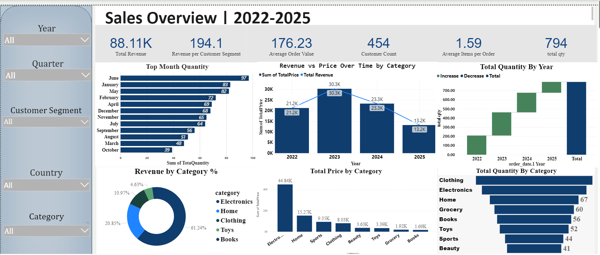

# 📊 Amazon Sales Analysis Dashboard

## 📌 Project Overview

The Amazon Sales Analysis Dashboard is a business intelligence project developed using Power BI to analyze sales performance, customer purchasing behavior, and product trends. The dashboard transforms raw sales data into actionable insights that support data-driven business decisions.

This project demonstrates data cleaning, data modeling, visualization, and dashboard development skills commonly used in Data Analytics and Business Intelligence roles.

---

## 🎯 Business Problem

Organizations generate large volumes of sales data daily. Without proper analysis, it becomes difficult to identify:

- Top-performing products
- Revenue trends
- Customer purchasing patterns
- Sales growth opportunities
- Regional performance variations

This dashboard helps stakeholders monitor key business metrics and make informed decisions.

---

## 🛠️ Tools & Technologies

| Category | Technology |
|-----------|------------|
| Data Visualization | Power BI |
| Data Source | CSV Dataset |
| Data Analysis | Power BI, Excel |
| Data Cleaning | Power Query |
| Reporting | Interactive Dashboard |

---

## 📂 Project Structure

```text
amazon-sales-analysis-dashboard/
│
├── Dashboard/
│   ├── amazonnnn.pbix
│   ├── dashboard_instructions.txt
│   └── image.png
│
├── Dataset/
│   └── powerbi_sales_data.csv
│
├── SALES DATA ANALYSIS PROJECT.pdf
├── README.md
└── .gitignore
```

---

## 📊 Dashboard Features

### Sales Performance Analysis
- Total Revenue Tracking
- Sales Trend Analysis
- Monthly Sales Performance
- Product Category Analysis

### Customer Insights
- Customer Purchase Behavior
- Order Distribution Analysis
- Customer Segmentation Insights

### Product Analysis
- Best-Selling Products
- Product Performance Comparison
- Revenue Contribution by Product

### Business KPIs
- Total Sales
- Total Orders
- Revenue Growth
- Average Order Value

---

## 📈 Key Insights

The dashboard helps identify:

- High-performing products and categories
- Revenue-driving business segments
- Seasonal sales trends
- Customer buying behavior
- Areas for sales optimization

---

## 🔍 Data Analysis Process

### 1. Data Collection
Sales data was collected and stored in CSV format.

### 2. Data Cleaning
- Removed missing values
- Corrected inconsistent records
- Standardized data formats

### 3. Data Transformation
- Created calculated fields
- Developed business metrics
- Built relationships where required

### 4. Dashboard Development
- KPI Cards
- Interactive Filters
- Trend Visualizations
- Performance Reports

### 5. Business Insights
Generated actionable insights from sales data to support strategic decision-making.

---

## 📸 Dashboard Preview

Add dashboard screenshots here.

Example:

```markdown

```

---

## 🚀 How to Use

### Open Power BI Dashboard

1. Download the repository.
2. Open the `.pbix` file using Power BI Desktop.
3. Refresh the dataset if required.
4. Explore the interactive dashboard.

---

## 📚 Skills Demonstrated

- Data Analytics
- Business Intelligence
- Data Visualization
- Power BI Dashboard Development
- KPI Design
- Data Cleaning
- Data Transformation
- Sales Analytics

---

## 💼 Business Value

This project enables organizations to:

- Monitor sales performance effectively
- Identify revenue opportunities
- Improve product strategy
- Support data-driven decision making
- Track business KPIs in real time

---

## 🔮 Future Enhancements

- Forecasting Sales Trends
- Customer Lifetime Value Analysis
- Profitability Dashboard
- Regional Sales Analysis
- Real-Time Data Integration

---

## 👨‍💻 Author

### Ananthsairam Goud

Aspiring Data Analyst | Business Intelligence Enthusiast

**Skills:**
- Python
- SQL
- Power BI
- Excel
- Machine Learning
- Data Analytics

GitHub: https://github.com/Ananthsairam

---

## ⭐ Project Status

✅ Completed

This project is part of my Data Analytics skills showcasing dashboard development and business intelligence skills.# Amazon-sales-analysis
